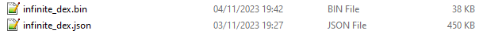

# Infinite Fusion Dex
A modification of https://github.com/Purukitto/pokemon-data.json/blob/master/pokedex.json to match Infinite Fusion    

Includes all the new pokemon announced so far

Code's shit, cry about it

# What does it do?
- Adjusts dex numbers to match infinite fusion
- Swaps abilities and types
- Adds a field to indicate if the pokemon's type given in fusion is overridden 

# How do I use it?
- Grab a release version
- Use it in your website/tool
OR
- Add a build step to trim it down to only the data you need (VERY RECOMMENDED)

Here's an example
```rust
// build.rs
type Ability = (String, bool);

// Only taking the data we want from the original
#[derive(Debug, Clone, Deserialize, Serialize)]
pub struct Pokemon {
    pub id: u16,
    pub name: String,
    pub hp: u8,
    pub attack: u8,
    pub defense: u8,
    pub special_attack: u8,
    pub special_defense: u8,
    pub speed: u8,
    pub primary_type: Type,
    pub secondary_type: Option<Type>,
    pub fusion_type_override: Option<Type>,
    pub abilities: Vec<Ability>,
}

impl From<RawPokemon> for Pokemon {
    fn from(raw: RawPokemon) -> Self {
        Pokemon {
            id: raw.id,
            name: raw.name.english,
            hp: raw.base.hp,
            attack: raw.base.attack,
            defense: raw.base.defense,
            special_attack: raw.base.special_attack,
            special_defense: raw.base.special_defense,
            speed: raw.base.speed,
            primary_type: raw.types[0],
            secondary_type: raw.types.get(1).copied(),
            fusion_type_override: raw.fusion_type_override,
            abilities: raw.profile.ability,
        }
    }
}

fn main() {
    // Load all the data
    let raw_pokemon: Vec<RawPokemon> =
        serde_json::from_str(include_str!("infinite_dex.json")).unwrap();
    // Take the bits we actually want
    let pokemon = raw_pokemon
        .into_iter()
        .map(Pokemon::from)
        .collect::<Vec<_>>();
    // Serialise it
    let bytes = bincode::serialize(&pokemon).unwrap();

    // The following is useful if you're using trunk otherwise "trunk serve" will keep refreshing
    // Check if we already have a version of the file
    if std::path::Path::new("infinite_dex.bin").exists() {
        // Only write the new file up if the data has actually changed
        let existing_bytes = std::fs::read("infinite_dex.bin").unwrap();
        if existing_bytes != bytes {
            std::fs::write("infinite_dex.bin", bytes).unwrap();
        }
    } else {
        // If we don't have a file just write it
        std::fs::write("infinite_dex.bin", bytes).unwrap();
    }
}
```

This quick crappy build step combined with moving from the json to binary with bincode dropped the size of my data significantly
